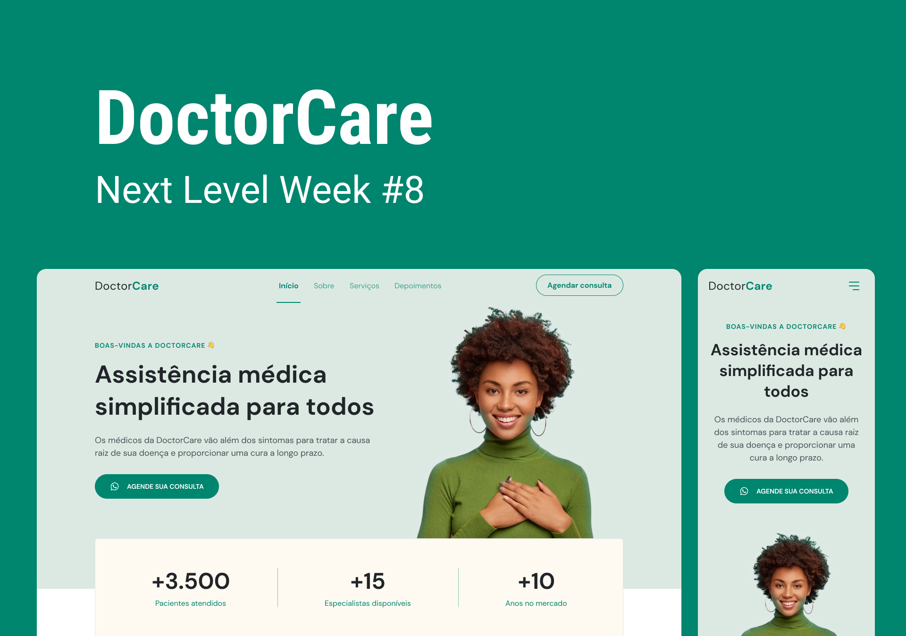

<h1 align="center">DoctorCare</h1>

## :memo: Descrição
Projeto em desenvolvimento no evento NLW Return da Rocketseat. O DoctorCare é uma Landing Page responsiva desenhada inicialmente para a plataforma de consultas médicas.

O objetivo desse projeto é desenvolver habilidades técnicas com linguagens voltadas para o desenvolvimento Front-end e habilidades comportamentais como comunicação, colaboração, resolução de problemas, autogerenciamento e responsabilização.





## 🛠️ Tecnologias utilizadas
* HTML (linguagem de marcação de HiperTexto);
* CSS (linguagem de estilo);
* Javascript (linguagem de programação);
* VS Code (Editor de código);

## 🚀 Rodando o projeto
Para rodar o repositório é necessário clonar o mesmo, dar o seguinte comando para iniciar o projeto:
```
git clone <https://github.com/patriciasilvadev/ladingpage-nlw8.git>
```

## Contato

E-mail - patriciasilva.dev@gmail.com

Desenvolvido com ❤️ Patrícia Silva


